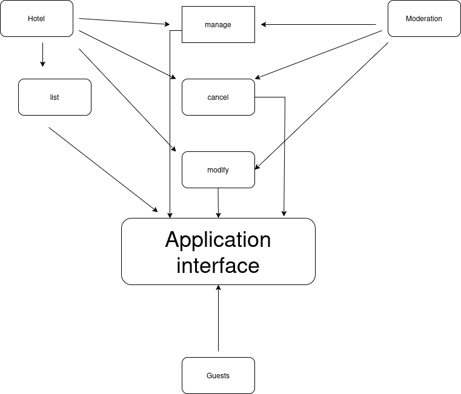

# Requirement Analysis in Software Development.
## What is Requirement Analysis?

Requirement Analysis, also known as Requirements Engineering, is the process of determining the needs or conditions that a new or altered software system must satisfy. It is one of the most critical phases in the Software Development Life Cycle (SDLC) because it lays the foundation for designing, developing, and delivering a successful software product.

During Requirement Analysis, stakeholders, including clients, users, and project managers, work together to gather and define detailed functional and non-functional requirements. Functional requirements specify what the system should do, while non-functional requirements outline system attributes such as performance, security, and usability.

### Importance of Requirement Analysis in SDLC

1. **Clarity and Understanding**  
   Requirement Analysis ensures that the development team clearly understands what the client expects from the software, reducing ambiguity and miscommunication.

2. **Cost and Time Efficiency**  
   Identifying requirements accurately at an early stage prevents costly changes and delays later in the project lifecycle.

3. **Improved Quality**  
   Well-defined requirements allow developers to build a system that meets user expectations, improving the overall quality of the product.

4. **Risk Reduction**  
   Thorough requirement analysis helps identify potential challenges or risks early, allowing the team to plan mitigation strategies in advance.

5. **Basis for Validation and Testing**  
   Requirements provide measurable criteria against which the system can be validated and tested, ensuring that the final product meets the intended purpose.
## Why is Requirement Analysis Important?

Requirement Analysis is a crucial phase in the Software Development Life Cycle (SDLC) because it ensures that the software project meets user expectations and business objectives. Here are three key reasons why it is important:

1. **Ensures Clear Understanding of Requirements**  
   Requirement Analysis helps the development team and stakeholders reach a shared understanding of what the software should achieve. By clarifying functional and non-functional requirements early, it reduces misunderstandings and miscommunications.

2. **Reduces Costs and Saves Time**  
   Detecting and addressing errors or ambiguities during the requirement phase is much cheaper and faster than making changes after development or deployment. Accurate requirements prevent unnecessary rework and project delays.

3. **Improves Software Quality and User Satisfaction**  
   With well-defined requirements, developers can build a system that aligns with user needs and business goals. This leads to higher-quality software, fewer defects, and better overall user satisfaction.

4. **Minimizes Project Risks**  
   Thorough requirement analysis identifies potential risks, technical challenges, and dependencies early in the project. This allows the team to plan mitigation strategies and avoid surprises later in the SDLC.
## Key Activities in Requirement Analysis

Requirement Analysis involves several structured activities to ensure that the software project is properly defined and aligned with user needs. The key activities include:

- **Requirement Gathering**  
  Collecting all the relevant information about what the stakeholders want from the system. This involves reviewing existing documentation, studying current systems, and understanding business processes.

- **Requirement Elicitation**  
  Engaging stakeholders through interviews, questionnaires, workshops, and observation to uncover both explicit and implicit requirements. This activity focuses on discovering what users actually need.

- **Requirement Documentation**  
  Recording the gathered and elicited requirements in a clear, organized, and standardized format. Common artifacts include requirement specifications, user stories, and use case diagrams.

- **Requirement Analysis and Modeling**  
  Examining requirements to resolve conflicts, ambiguities, and inconsistencies. Creating models such as data flow diagrams, entity-relationship diagrams, or prototypes helps visualize and validate requirements.

- **Requirement Validation**  
  Ensuring that the documented requirements accurately reflect stakeholder needs and are feasible, complete, and testable. This often involves reviews, walkthroughs, and approvals by stakeholders.
## Types of Requirements

Requirements in software projects are generally classified into **Functional Requirements** and **Non-functional Requirements**. Understanding the difference helps ensure that the system meets both user needs and quality standards.

### Functional Requirements

Functional requirements describe **what the system should do** — the specific behaviors, functions, or features the software must provide.

**Examples for a Booking Management System:**

- Users can create, view, update, and cancel bookings.  
- The system should send confirmation emails or SMS notifications after a booking is made.  
- Users can search for available slots based on date, time, and service type.  
- The system should generate reports for bookings and cancellations.  

### Non-functional Requirements

Non-functional requirements define **how the system should perform** — constraints and quality attributes that affect usability, reliability, and performance.

**Examples for a Booking Management System:**

- **Performance:** The system should handle up to 1000 concurrent users without slowing down.  
- **Security:** User data must be encrypted and access-controlled.  
- **Usability:** The interface should be intuitive and allow users to complete a booking within 3 steps.  
- **Availability:** The system should be available 99.9% of the time, including peak booking hours.  
- **Scalability:** The system should support expansion to multiple locations or services without significant redesign.  
## Use Case Diagrams

A **Use Case Diagram** is a visual representation of the interactions between **actors** (users or other systems) and the system itself. It helps in understanding the functional requirements and the scope of the system. Use Case Diagrams are particularly useful during Requirement Analysis because they:

- Clarify system boundaries and interactions.  
- Help identify functional requirements and user goals.  
- Provide a simple visual way to communicate with stakeholders.  
- Serve as a basis for designing test cases and system architecture.  

### Use Case Diagram for Booking Management System

The main **actors** in the booking system are:

- **User / Customer**: Makes, views, updates, or cancels bookings.  
- **Admin / Staff**: Manages bookings, updates availability, and generates reports.  

The key **use cases** include:

- Create Booking  
- View Booking  
- Update Booking  
- Cancel Booking  
- Send Confirmation Notification  
- Generate Reports  
- Manage Availability  

Below is the use case diagram illustrating these interactions:

## Acceptance Criteria

**Acceptance Criteria** are specific conditions or requirements that a software product must meet to be accepted by stakeholders, clients, or end-users. They define what “done” means for a particular feature or user story. Establishing clear acceptance criteria is crucial during Requirement Analysis because it ensures that all parties have a shared understanding of the expected behavior and quality of the system.

### Importance of Acceptance Criteria

- **Clarity:** Provides a clear, measurable definition of when a feature is complete.  
- **Quality Assurance:** Guides developers and testers to verify that the implementation meets the requirements.  
- **Stakeholder Alignment:** Ensures that the delivered functionality aligns with stakeholder expectations.  
- **Scope Control:** Helps prevent scope creep by clearly defining what is included and excluded for a feature.  

### Example: Checkout Feature in Booking Management System

For a **Checkout** feature, the acceptance criteria might include:

- The user can review selected bookings before confirming payment.  
- Payment can be completed using credit/debit cards or other supported payment methods.  
- A confirmation message and email receipt are generated upon successful payment.  
- The system prevents double bookings and updates availability immediately.  
- The checkout process is completed within 2 minutes under normal network conditions.  
